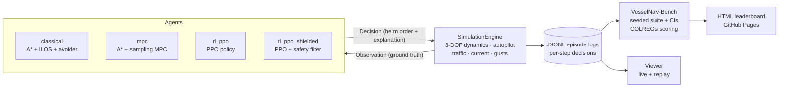

<div align="center">

# ⚓ VesselNav-Bench

### A transparent benchmark for autonomous ship navigation

**Classical pipelines · Model Predictive Control · Reinforcement Learning —
one physics engine, one exam, one leaderboard.**

[](https://github.com/captv89/autonomous-vessel-navigation/actions/workflows/ci.yml)
[](https://captv89.github.io/autonomous-vessel-navigation/)
[](LICENSE)
[](pyproject.toml)
[](https://doi.org/10.5281/zenodo.20689528)

</div>

A 2D ship navigation simulator and a **frozen, seeded benchmark** for
comparing navigation policies — rule-based, optimization-based (MPC),
learned (RL), shielded hybrids, or **your own** — under identical physics,
identical scenarios, and identical ground-truth scoring, with complete
visibility into every decision any approach makes.

**▶ Live leaderboard: https://captv89.github.io/autonomous-vessel-navigation/**

```bash
# Score any agent on the benchmark and get a ranked leaderboard
# (--workers N runs agent/condition blocks in parallel across N cores)
uv run python main.py benchmark --suite benchmarks/v1.yaml --workers 8 \
    --agent classical --agent mpc \
    --agent rl:models/ppo_vessel --agent rl-shielded:models/ppo_vessel \
    --agent your_package.your_module:YourAgent
```

Pass the same agent class with different model paths to compare them
(`--agent rl:models/ppo_10m --agent rl:models/ppo_vessel`); each is listed
separately as `rl_ppo[ppo_10m]`, `rl_ppo[ppo_vessel]`.

Submissions implement one small contract (`reset`/`decide`) — see
[docs/SUBMITTING.md](docs/SUBMITTING.md). The leaderboard reports success /
collision / grounding rates with Wilson 95% CIs, COLREGs-compliance scores
per encounter type, and efficiency metrics with bootstrap CIs; every number
is backed by a replayable episode log.

Current leaderboard on
[VesselNav-Bench v1](reports/benchmark-v1/leaderboard.md)
(9 scenarios x 20 seeded episodes per condition = 360 episodes per agent;
calm condition shown):

| # | Agent | Author | Score | Success | Coll. | Ground. | COLREGs | Time |
|---|---|---|---|---|---|---|---|---|
| 1 | classical | VesselNav-Bench | 97.9 | 100% | 0% | 0% | 0.95 | 63.2 s |
| 2 | mpc | VesselNav-Bench | 97.0 | 99.4% | 0% | 0% | 0.93 | **46.6 s** |
| 3 | velocity-obstacles | Fiorini & Shiller (1998) | 93.9 | 99.4% | 0% | 0% | 0.82 | 55.5 s |
| 4 | classical-legacy | VesselNav-Bench | 88.1 | 87.8% | 0% | 12.2% | 0.84 | 49.4 s |
| 5 | rl_ppo_shielded | VesselNav-Bench | 86.5 | 87.8% | **0%** | **0%** | 0.79 | 48.2 s |
| 6 | rl_ppo (PPO, 4M steps) | VesselNav-Bench | 82.4 | 87.2% | 0% | 12.8% | 0.62 | 39.5 s |
| 7 | potential-fields | Khatib (1986) | 48.4 | 44.4% | 55.6% | 0% | 0.33 | 71.9 s |

Three headline observations fall out of the table:

- **Three families plus a published external method, one exam**:
  rule-based, optimization-based, learned, and the classic Velocity
  Obstacles method (submitted exactly as any third party would — see
  [docs/SUBMITTING.md](docs/SUBMITTING.md)) are scored on identical
  seeded episodes with identical ground-truth metrics.
- **Safety shielding works**: wrapping the learned policy in a classical
  predictive filter removes all groundings (16.4% → 0) at a small cost in
  speed, with every intervention logged per decision.
- **Learning closes in but doesn't win (yet)**: 4M training steps lifted
  the pure policy to 83.6% success and zero collisions in calm water, but
  unfamiliar landmass shapes still ground it — the benchmark localizes
  exactly where the generalization gap lives.

## How the comparison stays fair and transparent

- **One physics engine.** All agents drive the same headless
  `SimulationEngine`: a 3-DOF surge-sway-yaw maneuvering model (Nomoto yaw
  channel, sideslip, turn speed loss, first-order surge), IMO rudder-rate
  limits, course-over-ground PD autopilot, water current + seeded wind
  gusts, dynamic traffic, grid-based land. The RL gymnasium env is a thin
  wrapper over it — there is no second physics implementation to drift.
- **One decision contract.** Every step, an agent returns a `Decision`:
  a helm order *plus a structured explanation*.
  - Classical: active mode (path following / avoidance), per-vessel CPA/TCPA
    and COLREGs encounter classification, cross-track error, and the full
    candidate-maneuver table with predicted miss distances and rejection
    reasons.
  - RL: the labeled observation vector the policy saw, the full action
    probability distribution, and the value estimate. The network weights are
    a black box; what it saw, what it considered, and how confident it was are
    not.
- **One log format.** Every episode is recorded step-by-step to JSONL and can
  be replayed in the viewer; all metrics are computed from ground-truth engine
  state in those logs, never from agent self-reports.
- **Identical exams.** Evaluation runs both agents on identical
  (scenario, seed) pairs.

## Quick start

```bash
uv sync                                   # install dependencies

uv run python main.py scenarios           # list scenarios
uv run python main.py simulate --agent classical --scenario head_on --render
uv run python main.py replay logs/classical_head_on_0.jsonl

# Any agent can be simulated/evaluated:
#   classical | classical-legacy | mpc | rl | rl-shielded  (rl/rl-shielded need --model)
uv run python main.py simulate --agent mpc --scenario head_on --render
uv run python main.py simulate --agent rl-shielded --model models/ppo_vessel --scenario head_on --render

# --scenario also takes a path to a world YAML (see worlds/):
uv run python main.py simulate --agent classical --scenario worlds/static_only.yaml --render

# RL: train, then watch / evaluate
uv run python main.py train --timesteps 500000
uv run python main.py simulate --agent rl --model models/ppo_vessel --scenario crossing_starboard --render

# Full comparison report (markdown + figures + per-episode logs)
uv run python main.py evaluate --agents classical,mpc,rl --model models/ppo_vessel --episodes 10
```

`--render` opens the pygame viewer (live); `replay` opens any recorded
episode with pause/step/speed controls and a decision-inspector panel.

### Side-by-side comparison animations

`scripts/make_comparison_animation.py` renders two episode logs (same scenario
and seed, different agents) into a single side-by-side MP4 — handy for blog
posts and talks. It is a standalone matplotlib script (no pygame/torch/SB3), so
it runs headless. First record the two episodes, then render:

```bash
uv run python main.py simulate --agent classical --scenario coastal --seed 1000 \
    --log logs/classical_coastal_seed1000.jsonl
uv run python main.py simulate --agent rl --model models/ppo_vessel --scenario coastal --seed 1000 \
    --log logs/rl_coastal_seed1000.jsonl

uv run python scripts/make_comparison_animation.py \
    --left logs/classical_coastal_seed1000.jsonl \
    --right logs/rl_coastal_seed1000.jsonl \
    --scenario coastal --seed 1000 \
    --out animations/classical_vs_rl_coastal.mp4
```

Land, planned route (classical only), traffic, wake trails and an end-of-episode
outcome banner are drawn from the JSONL log alone. `--speed` compresses playback
(default 8×, since the sim runs at dt=0.1 s) and the script falls back to PNG
frames if `ffmpeg` is unavailable.

### Worlds: define a scenario in a file

A world file is a self-contained YAML scenario — own-ship start/goal, static
obstacles, dynamic traffic, and optional `world`/`environment` overrides (e.g. a
sea current). It runs anywhere a registry scenario name does, without code
changes. Three examples ship in `worlds/`: `static_only` (landmasses, no
traffic), `dynamic_only` (open-water traffic), and `mixed` (both, plus a
current). To benchmark agents across worlds, point the runner at the example
suite (the frozen `benchmarks/v1.yaml` is never edited):

```bash
uv run python main.py benchmark --suite benchmarks/worlds.yaml \
    --agent classical --agent mpc
```

## Scenarios and the COLREGs rules they test

| Name | COLREGs rule | Situation |
|---|---|---|
| `open_water` | — | No obstacles; pure route following |
| `head_on` | Rule 14 | Reciprocal courses: both vessels alter to starboard, pass port-to-port |
| `crossing_starboard` | Rules 15/16 (give-way) | Traffic from starboard: take early, substantial action to keep clear |
| `crossing_port` | Rule 17 (stand-on) | Traffic from port: hold course and speed while it remains safe |
| `overtaking` | Rule 13 | Slow vessel ahead, same course: overtaker keeps clear, either side |
| `coastal` | Mixed | Landmasses forming a channel + two traffic vessels |
| `multi_vessel` | Rules 14+15 | Two simultaneous conflicts timed to overlap + a passer-by |
| `narrow_channel` | Rule 14 / Rule 9 flavor | Oncoming vessel inside a narrow fairway, limited sea room |
| `random` | Mixed | Seeded random islands and wandering traffic |
| `random_encounter` | 13/14/15 (training only) | Randomized guaranteed collision-course geometry; held out of the exam |

Benchmark conditions: **calm** (no disturbances) and **disturbed**
(scenario-seeded random current up to 0.3 cells/s + wind gusts) — every
agent faces the identical seeded episodes. The `benchmarks/v2.yaml` suite
adds a third, **degraded** condition: instead of AIS-grade ground truth, the
perceived traffic carries scenario-seeded position/course/speed noise, a
finite update interval (stale fixes on moving targets), and occasional target
loss — applied at the shared observation funnel so every agent (classical,
MPC, RL) sees the same degraded picture, while ground truth still drives
scoring. It measures sim-to-real robustness, not assumes it. Part of the
benchmark-v2 roadmap, separate from the frozen v1 exam.

**Ship domain (asymmetric passing distance).** v1 judges "passed too close"
with a circular safe distance. The `benchmarks/v2.yaml` suite scores the
passing-distance component against a four-quadrant Goodwin ship domain —
more clearance ahead than astern, biased to starboard (`src/sim/ship_domain.py`,
fore 1.5× / aft 0.5× / stbd 1.2× / port 0.8× the safe distance) — which is how
mariners and the compliance literature reason about closeness. All-1.0 (the
default) is the circular special case, so frozen v1 numbers are unchanged. The
scorer uses it now; the avoider is a planned follow-up. Part of the
benchmark-v2 roadmap.

**Reactive traffic (COLREGs give-way).** Traffic vessels default to holding
their course, but each can be given a `compliance` level — `compliant` or
`partial` makes a target take its own starboard give-way action when it is
the give-way vessel, so stand-on situations are tested against a target that
actually acts (`none`/`rogue` keep the default non-reactive behaviour). Set
it per vessel in a scenario or world file. This is part of the benchmark-v2
roadmap, separate from the frozen v1 exam.

Beyond these named scenarios, you can author your own world as a YAML file and
run it anywhere a scenario name is accepted — see [Worlds](#worlds-define-a-scenario-in-a-file)
above and the examples in `worlds/`.

**Imazu problem.** The 22 canonical Imazu encounter geometries (Sawada et al.
2021) are available as `imazu_01`…`imazu_22` and as a diagnostic suite, for
cross-referencing the COLREGs / deep-RL literature — see [docs/IMAZU.md](docs/IMAZU.md).
This is part of the benchmark-v2 roadmap, separate from the frozen v1 exam.

```bash
uv run python main.py simulate --agent classical --scenario imazu_13 --render
uv run python main.py benchmark --suite benchmarks/imazu.yaml --agent classical --agent mpc
```

## The agents, in plain language

Every agent answers the same question each step — *"given what I can see,
what course and speed do I order?"* — but arrives at the answer
differently:

| Spec | Family | Author | How it decides |
|---|---|---|---|
| `classical` | Rule-based | VesselNav-Bench baseline | A* plans a route, ILOS guidance steers along it, and a predictive COLREGs avoider overrides the helm when a rollout predicts a conflict — explicit rules, layered like a ship's bridge team |
| `classical-legacy` | Rule-based (ablation) | VesselNav-Bench baseline | The same pipeline with the project's original avoidance module — kept to measure how much the avoider matters |
| `mpc` | Optimization | VesselNav-Bench baseline | Solves a small optimal-control problem every second: simulate candidate maneuver plans with the real physics, pick the cheapest by one cost (progress + separation + effort + COLREGs prior) |
| `rl:<model>` | Learning | VesselNav-Bench baseline | A PPO neural policy trained in the simulator; no hand-written rules — behavior emerges from reward. Logs its action probabilities and value estimate every decision |
| `rl-shielded:<model>` | Hybrid | VesselNav-Bench baseline | The PPO policy proposes; a classical predictive filter vets every proposal and substitutes the nearest safe course when needed |
| `submissions...:VOAgent` | Reactive | Fiorini & Shiller (1998) | **Example external submission**: Velocity Obstacles — steer the velocity closest to the preferred course that lies outside every obstacle's collision cone |
| `submissions...:APFAgent` | Reactive | Khatib (1986) | **Example external submission**: Artificial Potential Fields — follow the resultant of attractive (route) and repulsive (traffic, land) forces; historically foundational, known weaknesses included on purpose |



## Architecture

```
main.py                 CLI: scenarios / simulate / train / evaluate /
                        benchmark / replay
configs/default.yaml    every tunable parameter (YAML mirror of src/config.py)
benchmarks/v1.yaml      frozen benchmark suite (scenarios, seeds, conditions)
benchmarks/v2.yaml      v1 + a degraded-perception robustness condition
benchmarks/worlds.yaml  example suite over the file-defined worlds in worlds/
worlds/                 file-defined worlds (YAML scenarios): static_only,
                        dynamic_only, mixed
docs/SUBMITTING.md      how to score your own model on the benchmark
docs/SIMULATOR.md       what the simulator models, gap analysis vs the
                        literature, and open review questions for mariners
src/
  config.py             typed config dataclasses
  sim/                  engine.py (headless physics loop), scenarios.py,
                        recorder.py (JSONL episode logs)
  agents/               base.py (Agent + Decision contract)
                        classical.py (A* + ILOS + avoidance)
                        avoidance.py (predictive COLREGs avoider, v2)
                        rl_agent.py (SB3 PPO policy wrapper)
  rl/                   observation.py (labeled feature vector, shared
                        train/eval), env.py (gymnasium), train.py (PPO)
  evaluation/           runner.py (seeded suites), metrics.py, report.py,
                        benchmark.py (leaderboard), colregs.py (rule
                        compliance scoring), stats.py (CIs)
  visualization/        viewer.py (pygame live + replay)
  environment/          grid world, traffic vessels, CPA/TCPA detection
  pathfinding/          A* + string pulling
  vessel/               Nomoto vessel model, ILOS/pure-pursuit followers,
                        legacy avoider (kept; select via config)
tests/                  pytest suite
examples/               original phase-1 matplotlib demos (still runnable)
```

### Classical pipeline
A* plans on a safety-inflated grid (waypoints string-pulled and re-split);
ILOS guidance tracks the route with progress-based waypoint switching; a
predictive avoider rolls out candidate course offsets (starboard first, per
COLREGs) using the *real* vessel model + autopilot against constant-velocity
traffic predictions, commits with hysteresis, and resumes the route when it
is predicted safe.

### RL pipeline
PPO (Stable-Baselines3) over a 34-feature observation (goal vector, own
dynamics, 16-ray land lidar, 3 nearest traffic vessels with closing speed).
Discrete course-change actions held for `rl.action_repeat` engine steps —
the same helm-order abstraction the classical agent uses. Reward is decomposed
(progress / time / near-miss / terminal events) and the per-component
breakdown is logged every step during training and evaluation.

## Vessel dynamics

`vessel.model` selects the dynamics (both share the factory used by the
engine *and* by the classical agent's prediction rollouts):

- `fossen3` (default): 3-DOF linear maneuvering model — Nomoto yaw channel
  (K, T keep their meaning), first-order sideslip toward `-gain*u*r`,
  turn-induced speed loss, first-order surge response, water current in the
  kinematics, seeded wind-gust forces.
- `nomoto`: the original first-order yaw model, kept for ablations.

Environmental disturbances live in the `environment` config section and can
be fixed or scenario-seeded (`randomize: true`), so every agent experiences
the identical realization per episode seed.

## Units & scale

World coordinates are **grid cells** (default 100x100, `cell_size` = 10 m per
cell → a 1 km² arena). Headings are radians internally, 0 = east,
counter-clockwise positive; config files use degrees where suffixed `_deg`.

Defaults are **to scale for a ~30 m small craft**: cruise `0.5 cells/s`
(5 m/s ≈ 9.7 kn), `K = 0.12` giving ~4.2 °/s steady yaw and a turn radius of
~6.8 cells (~68 m, ~2.3 ship lengths). Traffic vessels are scaled to match
(~0.25–0.45 cells/s). Edit `configs/default.yaml` to model a different
platform (e.g. a merchant ship needs a larger world for its ~0.6 km turning
circle).

**Course over speed, and turn anticipation.** Two behaviors keep maneuvering
realistic:

- *Course, not speed.* `control.min_speed_factor = 1.0` disables the old
  reduce-speed-in-turns behavior; the agent holds cruise and **alters course**
  (COLREGs Rule 8). Speed is only reduced for a last-resort avoidance escape
  or final approach. Set `min_speed_factor < 1.0` to restore speed reduction.
- *Wheel-over (`follower.turn_radius`).* The ILOS follower switches to the
  next leg `R·tan(Δψ/2)` **before** each waypoint, so the ship begins its
  turn in advance and the turn circle fits the corner — the way bridge teams
  and track-control systems steer — instead of overshooting and oscillating
  back. Set `turn_radius: 0` for the legacy switch-at-waypoint behavior.

> These are **v2** behavior/scale changes. The bundled `models/ppo_vessel`
> was trained at the previous scale; **retrain it** (`main.py train`) for a
> fair RL comparison under these defaults.

## Tests

```bash
uv run pytest
```

Covers dynamics (rudder-rate, Nomoto steady turn), engine termination and
determinism, follower switching (incl. the missed-waypoint regression),
avoidance COLREGs preference and hysteresis, classical agent end-to-end,
gymnasium API/reward decomposition, and recorder/metrics round-trips.

## Citing VesselNav-Bench

If you use VesselNav-Bench in your research, please cite it. Each release is
archived on Zenodo with a versioned DOI (see [`CITATION.cff`](CITATION.cff)
for machine-readable metadata). The concept DOI
[10.5281/zenodo.20689528](https://doi.org/10.5281/zenodo.20689528) always
resolves to the latest version:

```bibtex
@software{ravendranathan_vesselnavbench_2026,
  author  = {Ravendranathan, Vishnu},
  title   = {{VesselNav-Bench}: a transparent benchmark for
             autonomous vessel navigation},
  version = {1.0.0},
  year    = {2026},
  doi     = {10.5281/zenodo.20689528},
  url     = {https://github.com/captv89/autonomous-vessel-navigation}
}
```
