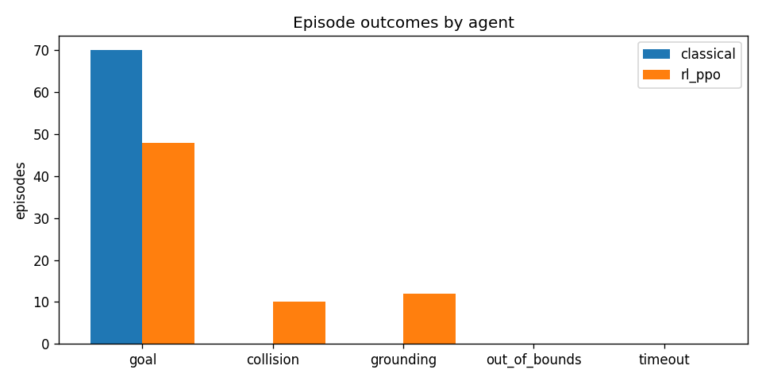
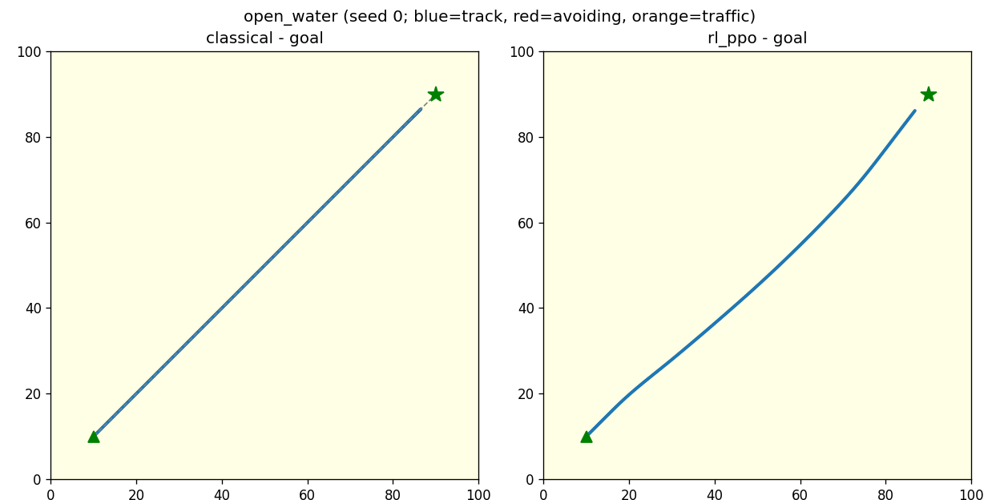
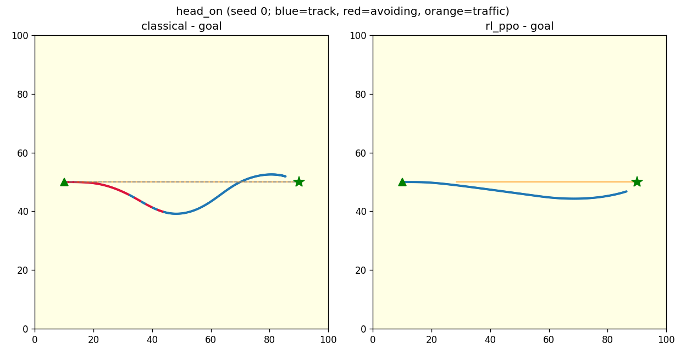
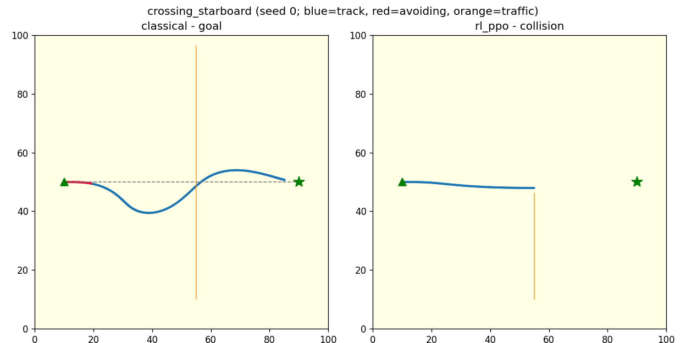
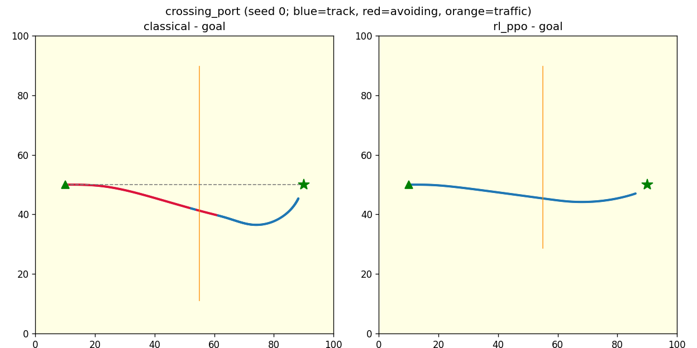
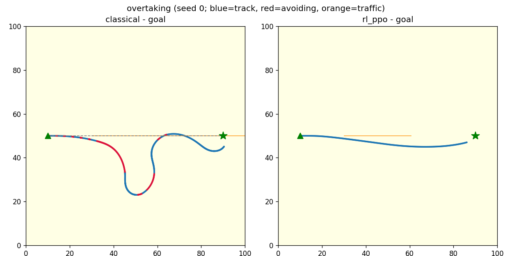
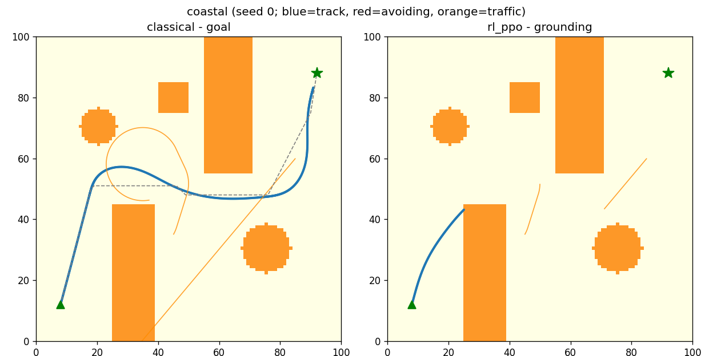
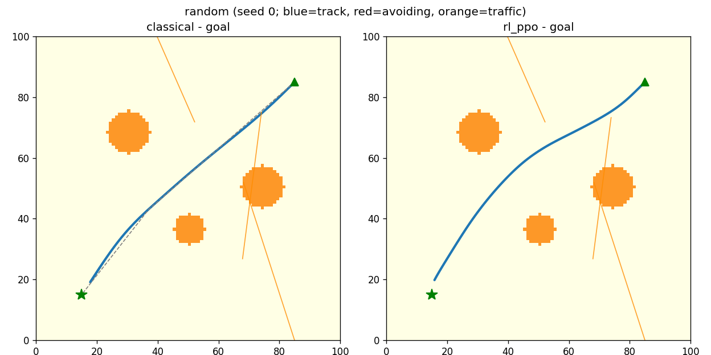

# Classical vs RL Navigation - Comparison Report

Generated: 2026-06-10T21:51:20  
Scenarios: open_water, head_on, crossing_starboard, crossing_port, overtaking, coastal, random  
Episodes per scenario: 10 (seeds 0..9, identical for every agent)

## Overall

| Metric | classical | rl_ppo |
|---|---|---|
| Success rate | 1 | 0.686 |
| Collision rate | 0 | 0.143 |
| Grounding rate | 0 | 0.171 |
| Timeout rate | 0 | 0 |
| Mean time to goal (s) | 51.9 | 35 |
| Path efficiency | 0.908 | 1.03 |
| Mean min separation | 14.1 | 10.6 |
| Near-miss steps | 0 | 26.8 |
| Mean |rudder| (deg) | 11.3 | 4.68 |
| Time avoiding (frac) | 0.198 | 0 |
| Starboard turns (frac) | 0.954 | - |

## Scenario: open_water

| Metric | classical | rl_ppo |
|---|---|---|
| Success rate | 1 | 1 |
| Collision rate | 0 | 0 |
| Grounding rate | 0 | 0 |
| Timeout rate | 0 | 0 |
| Mean time to goal (s) | 45.8 | 43.4 |
| Path efficiency | 1.04 | 1.04 |
| Mean min separation | - | - |
| Near-miss steps | 0 | 0 |
| Mean |rudder| (deg) | 0 | 2.53 |
| Time avoiding (frac) | 0 | 0 |
| Starboard turns (frac) | - | - |

## Scenario: head_on

| Metric | classical | rl_ppo |
|---|---|---|
| Success rate | 1 | 1 |
| Collision rate | 0 | 0 |
| Grounding rate | 0 | 0 |
| Timeout rate | 0 | 0 |
| Mean time to goal (s) | 37.8 | 30.8 |
| Path efficiency | 0.988 | 1.04 |
| Mean min separation | 10.6 | 4.52 |
| Near-miss steps | 0 | 30 |
| Mean |rudder| (deg) | 13.1 | 4.44 |
| Time avoiding (frac) | 0.341 | 0 |
| Starboard turns (frac) | 1 | - |

## Scenario: crossing_starboard

| Metric | classical | rl_ppo |
|---|---|---|
| Success rate | 1 | 0 |
| Collision rate | 0 | 1 |
| Grounding rate | 0 | 0 |
| Timeout rate | 0 | 0 |
| Mean time to goal (s) | 43.2 | - |
| Path efficiency | 0.966 | - |
| Mean min separation | 14.7 | 1.98 |
| Near-miss steps | 0 | 21 |
| Mean |rudder| (deg) | 15.1 | 3.54 |
| Time avoiding (frac) | 0.12 | 0 |
| Starboard turns (frac) | 1 | - |

## Scenario: crossing_port

| Metric | classical | rl_ppo |
|---|---|---|
| Success rate | 1 | 1 |
| Collision rate | 0 | 0 |
| Grounding rate | 0 | 0 |
| Timeout rate | 0 | 0 |
| Mean time to goal (s) | 39.5 | 30.7 |
| Path efficiency | 0.96 | 1.04 |
| Mean min separation | 9.9 | 6.96 |
| Near-miss steps | 0 | 27 |
| Mean |rudder| (deg) | 8.29 | 4.3 |
| Time avoiding (frac) | 0.511 | 0 |
| Starboard turns (frac) | 1 | - |

## Scenario: overtaking

| Metric | classical | rl_ppo |
|---|---|---|
| Success rate | 1 | 1 |
| Collision rate | 0 | 0 |
| Grounding rate | 0 | 0 |
| Timeout rate | 0 | 0 |
| Mean time to goal (s) | 78.5 | 30.6 |
| Path efficiency | 0.666 | 1.05 |
| Mean min separation | 10.8 | 2.98 |
| Near-miss steps | 0 | 98 |
| Mean |rudder| (deg) | 20.7 | 4.09 |
| Time avoiding (frac) | 0.341 | 0 |
| Starboard turns (frac) | 0.925 | - |

## Scenario: coastal

| Metric | classical | rl_ppo |
|---|---|---|
| Success rate | 1 | 0 |
| Collision rate | 0 | 0 |
| Grounding rate | 0 | 1 |
| Timeout rate | 0 | 0 |
| Mean time to goal (s) | 69.3 | - |
| Path efficiency | 0.779 | - |
| Mean min separation | 13.8 | 26.3 |
| Near-miss steps | 0 | 0 |
| Mean |rudder| (deg) | 11 | 6.62 |
| Time avoiding (frac) | 0 | 0 |
| Starboard turns (frac) | - | - |

## Scenario: random

| Metric | classical | rl_ppo |
|---|---|---|
| Success rate | 1 | 0.8 |
| Collision rate | 0 | 0 |
| Grounding rate | 0 | 0.2 |
| Timeout rate | 0 | 0 |
| Mean time to goal (s) | 49.3 | 40.5 |
| Path efficiency | 0.951 | 0.979 |
| Mean min separation | 24.6 | 20.7 |
| Near-miss steps | 0 | 11.6 |
| Mean |rudder| (deg) | 10.9 | 7.21 |
| Time avoiding (frac) | 0.072 | 0 |
| Starboard turns (frac) | 0.732 | - |

## Notes

- All metrics are computed from ground-truth engine state in the episode logs, never from agent self-reports.
- Per-step decision records (including avoidance candidate tables and RL action distributions) are in `episodes/*.jsonl`; replay any of them with `python main.py replay <file>`.
